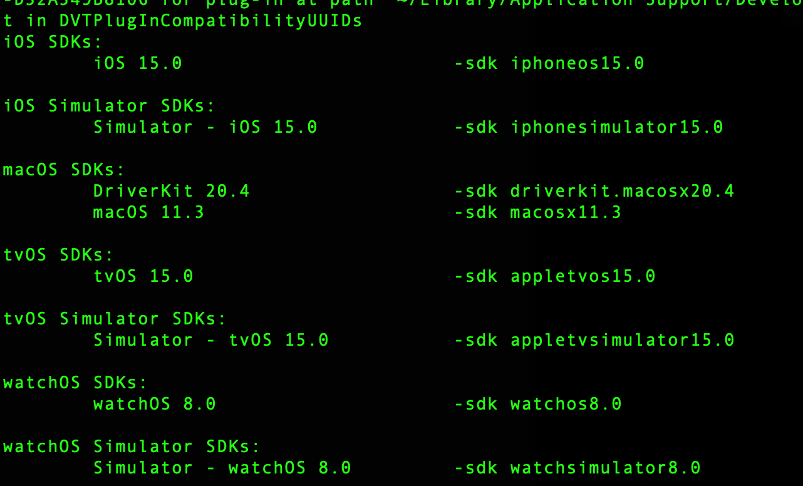

BuildSystemType:当前编译脚本的机器类型,由四部分组成:

```
${g_arch}-${vendor}-${os}${version}
```

对于自己当前电脑是:

```
x86_64-apple-darwin20.6.0
```

```
arch:uname -m
vendor:apple
os:uname -s
version:uname -r
```

# host

每个机器都有自己的host

${g_arch}-${vendor}-${os}${version}

arm64:

```
aarch64-apple-darwin
```

armv7:

```
arm-apple-darwin
```

x86_64

```
x86_64-apple-darwin
```

i386,86?

```
i386-apple-darwin
```

# CC

c编译器,每个arch对应的编译器也不一样.

## arm64:

```
xcrun -sdk ${os} clang -target ${g_arch}-${vendor}-${os}-${env}${g_minSdkVersion}
eg:
xcrun -sdk iphoneos clang -target arm64-apple-ios10.0
```

-sdk是xcrun的参数.

-target是clang的参数.

## armv7s:

```
armv7s-apple-darwin

xcrun -sdk iphoneos clang -target armv7s-apple-ios10.0

-miphoneos-version-min=8.0
```

## x86_64

```
x86_64-apple-darwin
xcrun -sdk iphonesimulator clang -target x86_64-apple-ios-simulator10.0

target参数容易出错.
-mios-simulator-version-min=8.0
```

```
xcrun --sdk iphonesimulator --show-sdk-path
xcrun -sdk iphonesimulator --show-sdk-path


```


## i386,86?

```
i386-apple-darwin
xcrun -sdk iphonesimulator clang -target i386-apple-iphoneos10.0
```

# 


# xcrun -sdk

xcrun -sdk后面可以用的参数可以用

```
xcodebuild -showsdks
```



# host

