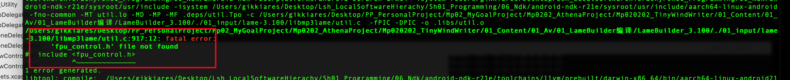
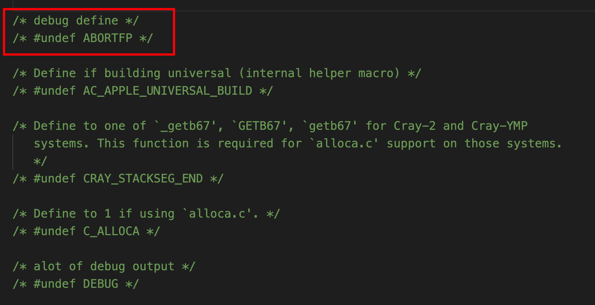

`<fpu_control.h>`

```
#if defined(ABORTFP)
#if defined(_MSC_VER)
    {
    }
#elif defined(__CYGWIN__)

# elif defined(__linux__)
    {
#  include <fpu_control.h>
#endif
#endif /* ABORTFP */

```

需要同时定义了ABORTFP和`__linux__`才会导入这个库.



要打开DEBUG,才会定义ABORTFP这个宏.如果不打开DEBUG就没问题.


--enable-debug的值有:

```
no,norm,yes,anoying,alot
```

打开debug就会定义ABORTFP宏

然后`__linux__`不知道在哪里定义的


glibc-2.3.2.tar.gz中有fpu_contro.h

glibc是[GNU](https://baike.baidu.com/item/GNU)发布的libc库，即c[运行库](https://baike.baidu.com/item/运行库/5587282)。glibc是[linux系统](https://baike.baidu.com/item/linux系统/1732935)中最底层的[api](https://baike.baidu.com/item/api/10154)，几乎其它任何运行库都会依赖于glibc。


glibc是linux下面c标准库的实现，即GNU C Library。glibc本身是GNU旗下的C标准库，后来逐渐成为了Linux的标准c库，而Linux下原来的标准c库Linux libc逐渐不再被维护。Linux下面的标准c库不仅有这一个，如uclibc、klibc，以及上面被提到的Linux libc，但是glibc无疑是用得最多的。


也就是说,fpu_control.h是glibc中的内容,但是这里引入的好像是libc,没有glibc.


解决方案:

自己把configure.h中的ABORTFP注释了.

```
http://en.verysource.com/code/6086956_1/fpu_control.h.html

```

