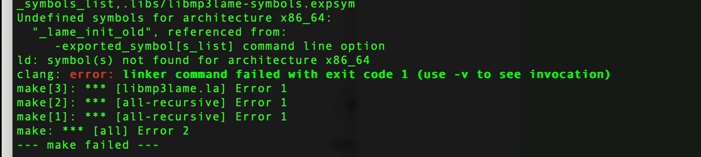
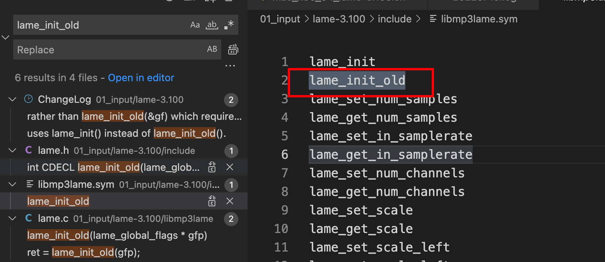
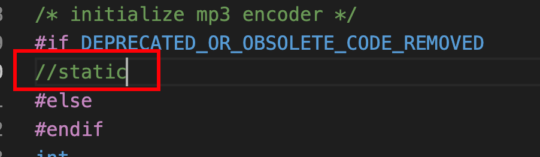

字面上的意思,就是没有找到lame_init_old这个函数的定义.

这个是在lame.c中的:

```
/* initialize mp3 encoder */
#if DEPRECATED_OR_OBSOLETE_CODE_REMOVED
static
#else
#endif

int
lame_init_old(lame_global_flags * gfp) {
	...
}
```



因为这个lame_init_old前面加了static,所以这个函数外部找不到的.

但是libmp3lame.sym中,又声明了要导出这个符号.

所以就会出错.


# 解决方案

1,将static注释掉




但是为什么其他平台又没有报错呢?
